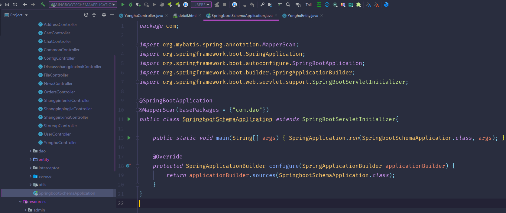
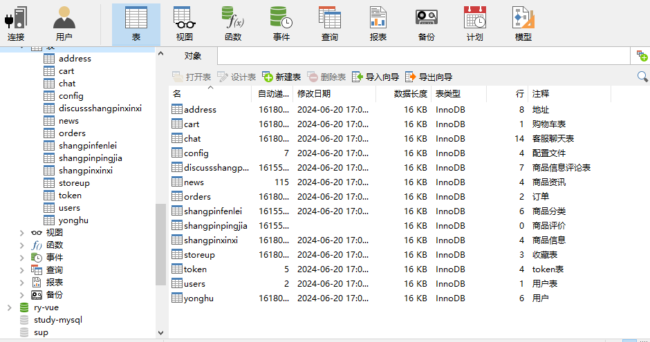
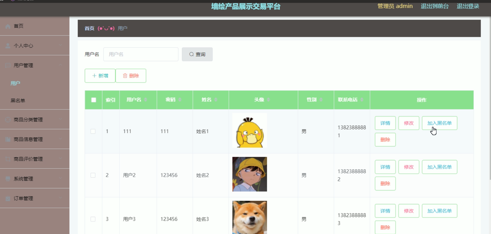
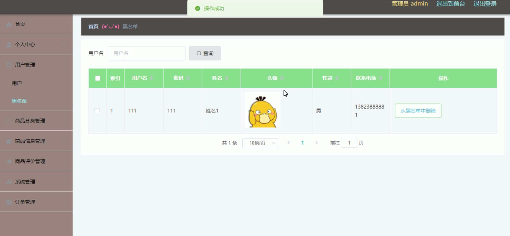
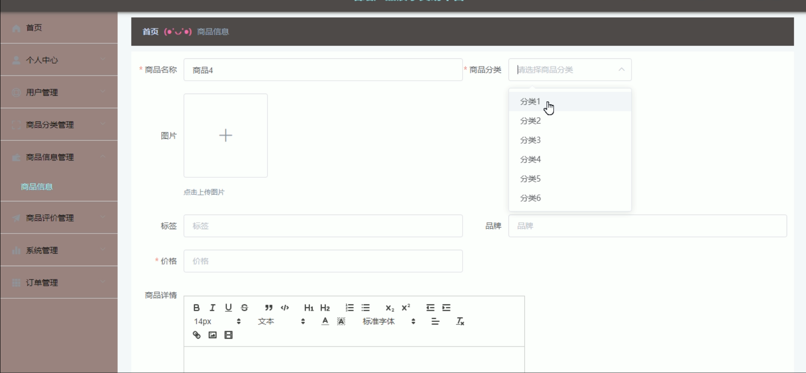
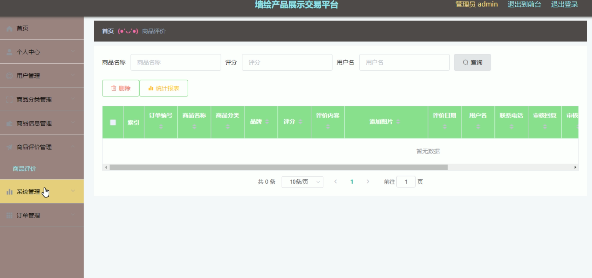
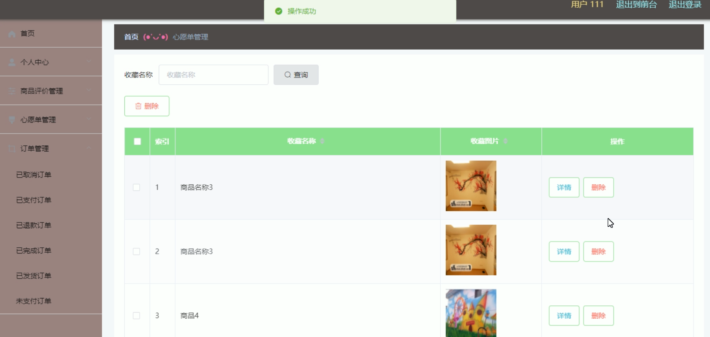

# 基于SpringBoot的墙绘产品展示交易平台

<h4 style='color:red'>联系不到我，就看我的主页 </h4> 
 
#### 介绍

基于SpringBoot的墙绘产品展示交易平台是一款专为墙绘艺术爱好者和艺术家设计的线上展示和交易平台，旨在提供一个便捷、安全、高效的墙绘作品展示与交易环境。系统分为管理员角色和用户角色，每个角色拥有特定的功能模块，以满足不同用户的需求和职责。

#### 技术栈

后端技术栈：Springboot+Mysql+Maven

前端技术栈：Vue+Html+Css+Javascript+ElementUI

开发工具：Idea+Vscode+Navicate

#### 系统功能介绍

管理员角色功能模块

个人中心：查看和编辑个人信息，包括修改密码和更新联系方式。

用户管理：管理平台用户信息，包括新增、修改、删除用户，确保用户数据的准确性。

黑名单：管理和维护黑名单用户，确保平台的安全和秩序。

商品分类管理：管理墙绘商品的分类信息，便于商品的整理和查找。

商品信息管理：管理墙绘商品的信息，包括新增、修改、删除商品，确保商品信息的及时更新。

商品评价管理：审核和管理用户对商品的评价，确保评价的真实性和可靠性。

系统管理：管理平台的各项系统设置，确保系统的正常运行和维护。

订单管理：管理所有订单信息，包括订单的查看、处理和跟踪，确保订单的及时处理和用户满意度。

用户角色功能模块

商品信息：查看墙绘商品的详细信息，包括商品描述、价格、图片等。

商品资讯：获取最新的墙绘商品资讯和推荐，了解市场动态和热门产品。

个人中心：查看和编辑个人信息，包括修改密码和更新联系方式。

后台管理：

商品评价管理：管理和查看个人对商品的评价记录，提交新的商品评价。

心愿单管理：管理心愿单中的商品，添加或删除心愿单商品，方便收藏和购买。

订单管理：查看和管理个人的订单信息，包括订单状态和历史记录。

购物车：管理购物车中的商品，查看商品详情、修改数量或删除商品，进行结算和支付。

客服：联系在线客服，获取帮助和解决问题，提升购物体验。

#### 系统作用

对管理员的作用

高效管理：系统提供全面的管理工具，帮助管理员高效地管理用户、商品和订单，确保平台的正常运营和发展。

信息维护：通过商品分类和信息管理，管理员可以及时更新和维护商品信息，保证信息的准确性和完整性。

安全保障：黑名单管理和商品评价审核功能，确保平台的安全和秩序，防止恶意用户和虚假评价。

对用户的作用

便捷购物：用户可以方便地浏览商品信息、添加购物车和管理订单，享受便捷的购物体验。

信息获取：通过商品资讯功能，用户可以及时获取最新的商品信息和推荐，了解市场动态。

互动反馈：商品评价和客服功能，用户可以分享购物体验和反馈问题，提升购物满意度。

#### 系统功能截图

代码结构

数据库表

登录

用户管理

黑名单

商品信息

商品评价管理

前台页面首页

购物车

商品资讯

客服

用户端管理后台

#### 总结

基于SpringBoot的墙绘产品展示交易平台通过角色分工和功能模块的设计，实现了墙绘产品展示和交易的高效化和便捷化。管理员可以通过系统高效管理用户、商品和订单，确保平台的安全和正常运营；用户则可以方便地浏览商品、管理购物车和订单，并与客服互动。该系统不仅提升了墙绘产品的展示效果，也为用户提供了便捷的购物体验和互动平台。

#### 使用说明

创建数据库，执行数据库脚本 修改jdbc数据库连接参数 下载安装maven依赖jar 启动idea中的springboot项目

后台管理 ：http://localhost:8080/qianghuichapin/admin/dist/index.html#/login 
前台展示： http://localhost:8080/qianghuichapin/front/pages/login/login.html 
管理员：  admin  密码：admin     

用户 111 等  密码 111 等

